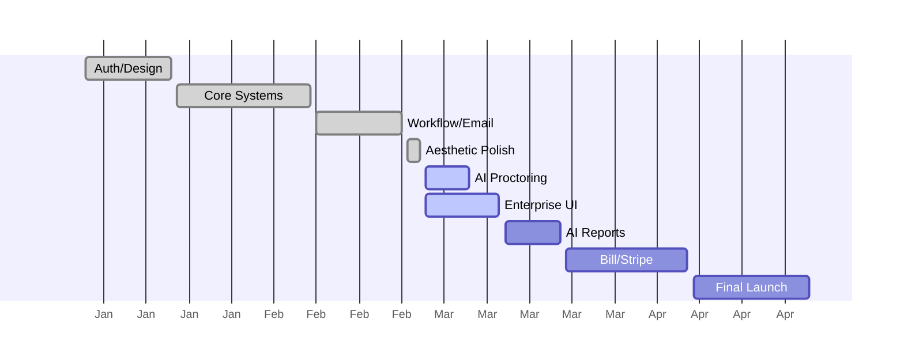

# NextGen Project Roadmap (Updated Feb 25, 2026)

This roadmap outlines the development timeline for **NextGen AI**, reflecting current achievements and the final development push through **April 2026**.

## 📊 Roadmap Visualization (Table View)
*Use this view if the Mermaid diagram below does not render correctly.*

| Phase | Milestone | Duration | Status | Lead |
| :--- | :--- | :--- | :--- | :--- |
| **Foundation** | Infra, Design Systems, Core UI | Jan 1 - Jan 15 | ✅ **Complete** | Team |
| **Core Systems** | Auth, Security, CRUD APIs | Jan 16 - Jan 25 | ✅ **Complete** | Dhruv |
| **Workflow** | **Job Application Workflow & Email Notifications** | Feb 1 - Feb 22 | ✅ **Complete** | Team |
| **UI Polish** | **Premium Dark Mode & Visibility Overhaul** | Feb 23 - Feb 25 | ✅ **Complete** | Ankit |
| **AI Security** | AI Proctoring 2.0 & Refresh Tokens | Feb 26 - Mar 5 | 🚀 **Active** | Dhruv |
| **Scaling** | Teams, Company Accounts & Bulk Actions | Mar 6 - Mar 20 | 📅 Planned | Ankit |
| **Launch** | Stripe Integration & Final Production deployment | Mar 21 - Apr 30 | 📅 Planned | Team |

---

## 📈 Detailed Gantt Chart (Mermaid)

---

## 💡 How to use this for Presentations
If the Mermaid chart doesn't render in your viewer:
1. **Copy the Mermaid Code block** (lines 28-44).
2. Go to **[Mermaid.live](https://mermaid.live)**.
3. Paste the code to get a high-quality **PNG/SVG** image.
4. Download and insert that image directly into your Slides or Sheets.

> [!TIP]
> **Pro Tip**: Use the **Table View** at the top for quick readability during mentor meetings, as it is 100% compatible with all Markdown viewers.
