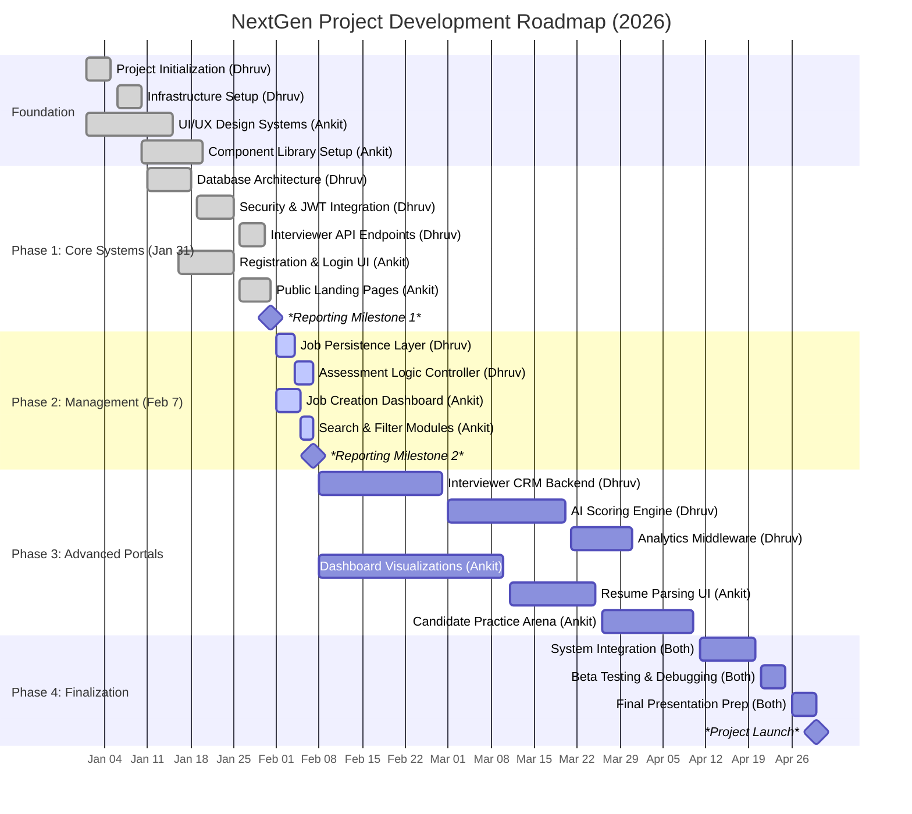

# NextGen Project Gantt Chart

This chart outlines the development timeline for the **NextGen AI Technical Assessment Portal**, starting from the internship commencement on **January 1st, 2026**, through to completion in **April 2026**.

## Team Responsibilities

| Name | Role | Focus Areas |
| :--- | :--- | :--- |
| **Dhruv** | Fullstack & Backend Lead | Backend Architecture, DB Design, AI Logic, Authentication |
| **Ankit** | Frontend Developer | UI/UX Design, Dashboards, Client-side Components |

---

## Project Timeline (Detailed)

## � How to add this to Google Sheets or Google Slides

Since Google Sheets and Slides have limited support for SVG, use the **PNG** format for the best results:

1.  **Generate High-Quality PNG**:
    *   Go to [Mermaid.live](https://mermaid.live).
    *   Paste the code from this file.
    *   Click **Actions** > **Download PNG**.
2.  **Insert into Google Sheets**:
    *   Go to **Insert** > **Image** > **Image over cells**.
    *   Upload the PNG you just downloaded.
3.  **Insert into Google Slides**:
    *   Go to **Insert** > **Image** > **Upload from computer**.
    *   Select your PNG file.
4.  **Quickest Way (Copy/Paste)**:
    *   In the Mermaid Live editor, right-click the rendered chart image.
    *   Select **Copy Image**.
    *   Go to your Google Sheet or Slide and press **Ctrl + V** to paste it directly.

> [!NOTE]
> The timeline highlights key reporting milestones on **January 31st** and **February 7th** as assigned by your mentor.
