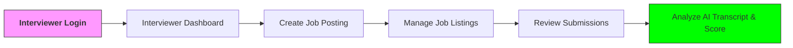
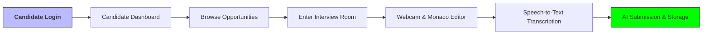
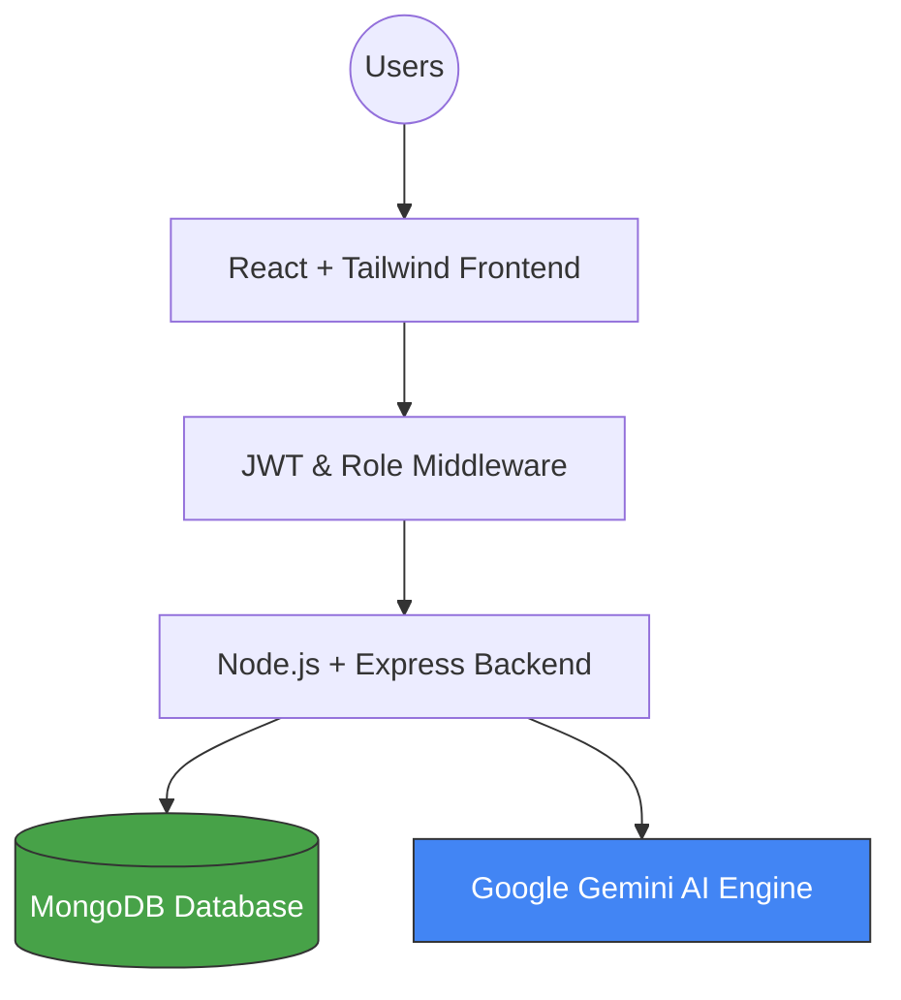

# Project Presentation Content: NextGen

This document contains the slide-by-slide content for your project presentation, exactly following the 12-point requirement list.

---

### Slide 1: Title Slide
- **Project Title:** NextGen - AI Technical Assessment Portal
- **Domain:** Web Application / AI-Driven HR Tech
- **Presented By:** Dhruv (Fullstack & Backend) & Ankit (Frontend)
- **Internship Start:** Jan 1, 2026

---

### Slide 2: Outline of Presentation
1. Project Introduction & Structure
2. Tools & Technology (Justification)
3. Hardware & Software Specifications
4. Industry Practices & Coding Conventions
5. Functional & Non-Functional Requirements
6. Motivation & Learning Outcomes
7. Future Scope & Planning

---

### Slide 3: Project Structure & Flow (Visual Diagrams)

#### Interviewer Workflow

#### Candidate Workflow

#### System Architecture Overview

---

### Slide 4: Tools & Technology (Justification)
- **Frontend: React.js & Tailwind CSS:** Chosen for high performance, modular component architecture, and rapid UI development with premium visuals.
- **Backend: Node.js & Express.js:** Efficient handle of asynchronous requests (crucial for real-time code editing and AI processing).
- **Database: MongoDB:** Flexible schema design allowing for evolving interview data and metadata storage.
- **AI: Google Gemini API:** Provides state-of-the-art natural language processing for real-time interview questions and transcript analysis.

---

### Slide 5: Hardware & Software Specifications
- **Hardware:** 
  - Processor: Intel i5 / Ryzen 5 (Minimum)
  - RAM: 8GB (Minimum)
  - Camera: Integrated HD Webcam (for interview feature)
- **Software:**
  - OS: Windows/macOS/Linux
  - Environment: Node.js (v18+), Git
  - Database: MongoDB Community Server / Atlas
  - Browser: Chrome/Edge (latest) for Speech-to-Text API support.

---

### Slide 6: Industry Practices Adopted
- **Agile Methodology:** Working in two-week reporting cycles with clear milestones.
- **Version Control:** Consistent use of Git for collaborative development and code history.
- **Environment Management:** Securely managing credentials using `.env` files.
- **Responsive Design:** Using a "mobile-first" approach for the candidate discovery portal.

---

### Slide 7: Coding Convention
- **Naming:** CamelCase for variables/functions; PascalCase for React components.
- **Structure:** Modular file organization (Controllers, Routes, Models, Components).
- **Linting:** Standard ESLint rules for maintaining code consistency.
- **Security:** Implementing Middleware for JWT verification and role-based access control.

---

### Slide 8: Functional Requirements (Project Scope)
- Secure Multi-role Authentication (Interviewer/Candidate).
- Dynamic Job CRUD (Create, Read, Update, Delete) for recruiters.
- Live Interview Module with synchronized webcam feed and code editor.
- Automatic Speech-to-Text transcription during live rounds.
- Automated feedback generation using Gemini AI.

---

### Slide 9: Non-Functional Requirements
- **Performance:** Optimized API responses for a smooth "Glassmorphism" UI experience.
- **Security:** High-level encryption for passwords and secure session management.
- **Scalability:** Built on a micro-service-ready folder structure.
- **User Experience:** Minimalist, high-contrast UI for focus during interviews.

---

### Slide 10: Motivation (Project & Company)
- **Project Motivation:** To solve the inefficiency and high cost of first-round technical screenings using automated AI tools.
- **Company Alignment:** Interested in building scalable, real-world SaaS products that impact the talent acquisition industry.

---

### Slide 11: Learning Outcome (Till Date)
- Proficiency in MERN stack integration.
- Implementing real-time communication flows (Speech-to-Text & AI).
- Managing secure role-based portals in a single application.
- Professional documentation and reporting standards.

---

### Slide 12: Further Planning
- **Phase 3:** Advanced Interviewer CRM and Data Analytics (Chart.js integration).
- **Phase 4:** Resume Parsing UI and Final System Integration testing.
- **Deployment:** Hosting on Vercel/Render for live stakeholder review.

---

### 📝 Final Reminders for Presentation Day:
1. **Documents to Carry:** Weekly Reports (signed), Evaluation file, and the Approval page.
2. **Dress Code:** Be in Professional Formals.
3. **Live Demo:** Have the portal running locally on your laptop just in case!
